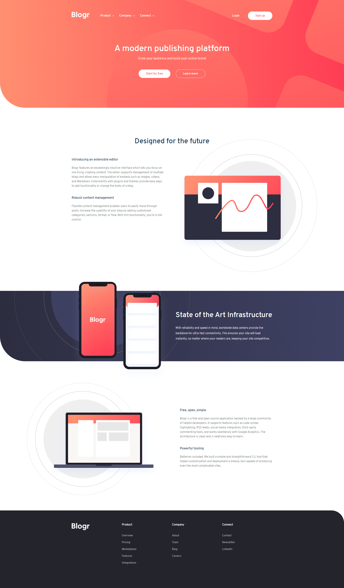

# Frontend Mentor - Blogr landing page solution

This is a solution to the [Blogr landing page challenge on Frontend Mentor](https://www.frontendmentor.io/challenges/blogr-landing-page-EX2RLAApP). Frontend Mentor challenges help you improve your coding skills by building realistic projects. 

## Table of contents

- [Overview](#overview)
  - [The challenge](#the-challenge)
  - [Screenshot](#screenshot)
  - [Links](#links)
- [My process](#my-process)
  - [Built with](#built-with)
- [Author](#author)

## Overview

### The challenge

Users should be able to:

- View the optimal layout for the site depending on their device's screen size
- See hover states for all interactive elements on the page

### Screenshot

- Mobile Device Screenshot

- Tablet Device Screenshot

- Desktop Device Screenshot

### Links

- Solution URL: [Solution](https://your-solution-url.com)
- Live Site URL: [Github Pages](https://marif0025.github.io/blogr-template/)

### Built with

- Semantic HTML5 markup
- CSS custom properties
- Flexbox

## Author

- Website - [Github](https://github.com/marif0025)
- Frontend Mentor - [@marif0025](https://www.frontendmentor.io/profile/marif0025)
- Twitter - [@iamarif005](https://www.twitter.com/iamarif005)
